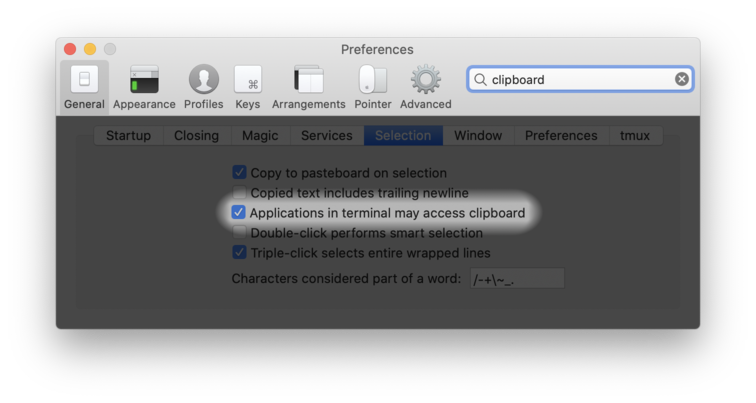

.. _tmux:

tmux configuration
==================

If you're on a Mac and don't have tmux installed, you can use ``./setup.sh
--install-tmux``. This will create a new environment with tmux and symlink the
executable to your ``~/opt/bin`` directory. This expects that you've already
set up conda (with ``./setup.sh --install-conda``).

Here are the general features of the ``.tmux.conf`` file:

-  Set the prefix to be ``Ctrl-j`` (instead of the default ``Ctrl-b``)
-  Use mouse
-  Reset escape key time to avoid conflicting with vim
-  Set a large history size
-  Use vim mode for navigating in copy mode
-  When creating a new window or pane, automatically change to the
   directory of the current window or pane.

.. versionadded:: 2024-10-14

   When selecting with the mouse, it will no longer automatically exit copy
   mode. This lets you scroll up through history and select text without
   jumping back down to the prompt. To copy the text, hit :kbd:`Enter` after
   selecting.

Here are some shortcuts for window and pane navigation:

.. list-table::
   :header-rows: 1
   :align: left

   * - command
     - description

   * - :kbd:`Alt-arrows`
     - move around panes
   * - :kbd:`Shift-arrows`
     - switch windows (left/right only)

.. _tmuxcopy:

Copy/paste in vim and tmux
--------------------------

.. versionchanged:: 2024-10-14

   With OSC 52 support in recent versions of nvim, Alacritty, iTerm2, and tmux,
   copy/paste is dramatically simplified.

Historically, copy/paste in tmux has been very annoying. Now, with ``OSC 52``
support in modern terminal applications, it's much smoother experience.

Specifically, you should use a modern terminal emulator like iTerm2 or
Alacritty. Among other things, these terminals support the ``OSC 52`` escape
code, which allows you to copy text from a remote machine running vim within
tmux...all the way to your OS clipboard (that is, on the machine running the
terminal app).

The built-in macOS Terminal.app does NOT do this.

This support was added in nvim 0.10, and recent versions of tmux support it.
Alacritty supports it by default. iTerm2 has had support for a while now, but
you do need to manually enable it:

Using these dotfiles, and using recent versions of iTerm2 or Alacritty, you
should be able copy text in any of the following ways, and it will make it onto
the vim, tmux, and OS clipboards:

- yank or delete text in nvim
- use the mouse to select text in tmux (automatically enters copy mode) from the shell and press enter
- use tmux copy mode in the shell

You can use :kbd:`Cmd-v` to paste anywhere, :kbd:`p` in nvim, :kbd:`<prefix>]` in tmux. That is, all the ways of pasting should work.

You can optionally hold :kbd:`Shift` to *only* copy the OS clipboard (bypassing
tmux and nvim).

When copying from vim, use :kbd:`<leader>cp` to toggle additional decorations
(like the vertical lines showing indentations) to make copied text cleaner.
